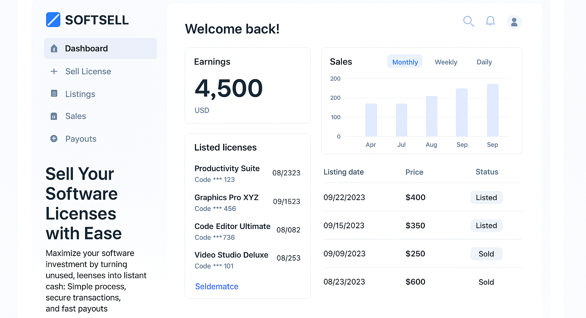

# SoftSell


SoftSell is a modern platform for selling and managing software licenses. Built with React, Vite, and TailwindCSS, this platform offers seamless UI and UX, with advanced features to maximize efficiency and user satisfaction.


---

## Features

- **Dynamic Hero Section**: Highlight your product with smooth animations powered by [Framer Motion](https://www.framer.com/motion/).
- **Interactive Header**: Dropdowns for Solutions, Products, Resources, and Pricing, with responsive design and engaging hover effects.
- **Light/Dark Theme Toggle**: Easily switch between themes with a persistent preference stored in local storage.
- **Contact Modal with Frontend Validation**: A modal with built-in validation for user-friendly and error-free interactions.
- **Customer Chat Widget**: Integrated chat feature, currently functional, with plans to incorporate AI for smarter customer interactions.
- **Dashboard and Purchase Visuals**: Showcase key features with high-quality dashboard and checkout screenshots.
- **Responsive Design**: Tailored for both desktop and mobile devices, ensuring a seamless experience for all users.

---

## Getting Started

Follow these instructions to get a local copy of the project up and running.

### Prerequisites

- Node.js (v16 or higher)
- npm (v7 or higher)

### Installation

1. Clone the repository:
   ```bash
   git clone https://github.com/preetiGusain/softsell.git
   ```

2. Navigate to the project directory:
   ```bash
   cd softsell
   ```

3. Install dependencies:
   ```bash
   npm install
   ```

4. Start the development server:
   ```bash
   npm run dev
   ```

The application will be available at `http://localhost:5173`.

---

## Deployment

To deploy the project on GitHub Pages:

1. Install the `gh-pages` package:
   ```bash
   npm install gh-pages --save-dev
   ```

2. Add the following scripts to your `package.json`:
   ```json
   "scripts": {
     "predeploy": "npm run build",
     "deploy": "gh-pages -d dist"
   }
   ```

3. Deploy the application:
   ```bash
   npm run deploy
   ```

The application will be live at `https://preetiGusain.github.io/softsell/`.

---

## Tech Stack

- **Frontend Framework**: React
- **Build Tool**: Vite
- **Styling**: TailwindCSS
- **Animations**: Framer Motion
- **Icons**: Lucide React

---

## Project Structure

```plaintext
src
├── assets          # Static assets like images and logos
├── components      # Reusable React components
│   ├── ContactModal    # Contact modal with frontend validation
│   ├── ChatModal       # Customer chat widget
│   ├── Header          # Navbar with dropdown menus
│   ├── Hero            # Landing section with animations
│   ├── ThemeToggle     # Light/Dark theme toggle button
├── App.jsx         # Main application component
├── index.css       # Global styles
└── main.jsx        # Entry point
```

---

## Screenshots

### Hero Section


### Dashboard


### Checkout


---

## Future Plans

- **AI-Powered Chat Widget**: Enhance customer support with AI integration.
- **Analytics Dashboard**: Provide detailed insights into software sales and usage.
- **Global Payment Support**: Expand payment options for international customers.

---

## Contributing

Contributions are welcome! Please follow these steps:

1. Fork the repository.
2. Create a new branch:
   ```bash
   git checkout -b feature-name
   ```
3. Commit your changes:
   ```bash
   git commit -m 'Add some feature'
   ```
4. Push to the branch:
   ```bash
   git push origin feature-name
   ```
5. Open a pull request.

---

## License

This project is licensed under the MIT License. See the `LICENSE` file for details.

---

## Acknowledgements

- [React](https://reactjs.org/)
- [Vite](https://vitejs.dev/)
- [TailwindCSS](https://tailwindcss.com/)
- [Framer Motion](https://www.framer.com/motion/)
- [Lucide Icons](https://lucide.dev/)
